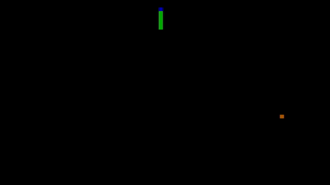

# Boot Sector Snake

This is a classic Snake game written entirely in 16-bit x86 assembly language. The entire game fits within a 512-byte boot sector, meaning it can be booted and run on a computer without any underlying operating system.




## Features

- **OS-less:** Runs directly from the boot sector after the BIOS POST.
- **Pure Assembly:** Written entirely in x86 assembly, compatible with the FASM assembler.
- **Compact:** Fits within the 512-byte limit of a Master Boot Record (MBR).
- **VGA Text Mode:** Utilizes the 80x50 character text mode for a larger playing field.
- **Interrupt Driven:** Hooks the hardware timer interrupt (`int 8`) for a consistent game loop and the keyboard interrupt (`int 9`) for responsive controls.
- **Classic Gameplay:** Eat food to grow longer, and the game ends if you collide with yourself. The screen edges wrap around.

## How to Build and Run

You will need `fasm` (The Flat Assembler) and `qemu` to build and test the game.

### Prerequisites

- **FASM:**
  - On Debian/Ubuntu: `sudo apt-get install fasm`
  - On Windows: Download from the [FASM website](https://flatassembler.net/).
- **QEMU:**
  - On Debian/Ubuntu: `sudo apt-get install qemu-system-x86`
  - On Windows: Download from the [QEMU website](https://www.qemu.org/download/).

### Building the Game

The included `Makefile` simplifies the process.

1.  **Clone the repository:**
    ```bash
    git clone  https://github.com/NovoselovNS/snake_asm.git
    cd snake_asm
    ```

2.  **Build the binary:**
    ```bash
    make
    ```
    This will execute `fasm snake.asm`, creating a 512-byte `snake.bin` file.

### Running the Game

- **Using the Makefile:**
  ```bash
  make run
  ```
  This command will launch QEMU and boot directly from the `snake.bin` file.

- **Manually with QEMU:**
  ```bash
  qemu-system-x86_64 -drive format=raw,file=snake.bin
  ```

To exit QEMU, press `Ctrl+Alt+G` to release the cursor, then close the window.

## Controls

Use the **Arrow Keys** to control the snake's direction:

- **↑** - Move Up
- **↓** - Move Down
- **←** - Move Left
- **→** - Move Right

The snake cannot immediately reverse its direction (e.g., move from up to down).

## How It Works

The game leverages low-level BIOS and hardware features to run.

### Booting

- `org 7c00h`: This directive tells the assembler that the code will be loaded by the BIOS at memory address `0x7C00`. This is the standard address for boot sector code.
- The last two bytes (`0x55`, `0xAA`) form the boot signature, which the BIOS checks to identify a valid bootable device.

### Graphics

- The game first switches to 80x50 16-color text mode using BIOS interrupt `int 10h` with `ax = 1112h`.
- Graphics are rendered by writing directly to the VGA text mode memory at address `0xB8000`.
- Each character cell on the screen is represented by two bytes: the character byte and the attribute byte (color).
- The snake and food are drawn as colored spaces. The colors are set in the attribute byte, like `body_char = 2 shl 12` which sets a green background (`0x20`) and a null character (`0x00`).

### Game Loop and Input

- **Timer Interrupt (`int 8`):** The game hijacks the system's timer interrupt. By default, this interrupt fires 18.2 times per second. The game's `int8` handler is called on each tick, which then calls the main `draw` function to update the game state and redraw the screen. A `delay` variable is used to control the game speed by skipping some ticks.

- **Keyboard Interrupt (`int 9`):** The keyboard interrupt handler (`int9`) is also replaced. When a key is pressed, our handler reads the scancode from port `0x60`. If it's one of the arrow keys, it updates the `code` variable, which stores the snake's current direction.

### Game Logic

- **Snake Representation:** The snake is stored as an array of word-sized coordinates (X in the low byte, Y in the high byte) starting at the `first_segm` label. A pointer, `last_segm_ptr`, tracks the location of the snake's tail.
- **Movement:** On each game tick, the coordinates in the array are shifted one position towards the tail. Then, a new head coordinate is calculated based on the current direction.
- **Growth:** When the snake eats food, the `last_segm_ptr` is incremented. This effectively increases the size of the coordinate array, so the last segment of the tail is not erased on the next move, making the snake one segment longer.
- **Collision:** Collision is detected when the head's next position contains a `body_char`. This triggers a call to `start_game`, restarting the game.

## License

This project is licensed under the MIT License.